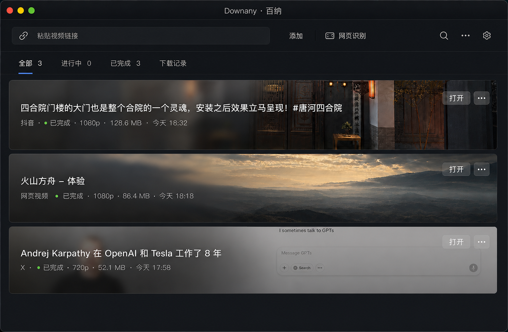

# Downany · 百纳 Desktop UI Profile v1.0

- 状态：已确定视觉方向，待实现
- 上位规范：[Downany Design System](DESIGN-SYSTEM.md)
- Profile 范围：Electron 主窗口、历史、设置、对话框、Toast 与抓取窗口
- 视觉基准：[主窗口强高斯玻璃原型](assets/downany-main-window-glass-v1.png)
- 核心句：**媒体是内容，玻璃承载信息，窗口镀铬保持安静。**



原型用于确认气质、层级和材质，不作为像素尺寸来源。实现时以本文的逻辑像素、语义令牌、交互状态和可访问性规则为准。

## 1. 设计目标

Downany 是单一目的明确的桌面工具，不是管理后台或内容平台。界面应让用户快速完成三件事：加入链接、判断任务状态、处理结果文件。

设计必须同时满足：

1. **原生工具感**：遵循 macOS / Windows 桌面交互习惯，操作层与窗口标题层分离。
2. **媒体优先**：任务缩略图构成队列主体，不再使用“左缩略图 + 右表格字段”的后台式布局。
3. **克制的高级感**：层次来自影像、排版、材质和微弱对比，不依赖大色块、厚阴影或过多圆角。
4. **高信息密度**：控件紧凑，状态可扫读，但不拥挤。
5. **可降级**：模糊、透明和动效关闭后，信息和操作仍完整可用。

## 2. 四条不可破坏的原则

### 2.1 窗口层与操作层分离

- 标题栏只承载窗口控制和产品名 `Downany · 百纳`。
- 粘贴链接、添加、网页识别、搜索、批量操作和设置全部位于独立操作栏。
- macOS 预留左侧交通灯区域；Windows 使用系统窗口按钮，不模拟交通灯。

### 2.2 只使用一种主动强调

- 同一区域不得同时出现高亮底、粗字和下划线。
- 筛选项激活态采用“文字提亮 + 2px 短指示线”。
- 主操作只在需要引导用户决策时使用蓝色，常驻工具栏不得出现大面积饱和蓝按钮。

### 2.3 状态色只做标记

- 完成：小型绿色圆点或勾选图标 + `已完成`。
- 下载中：蓝色状态点 + 2px 进度线。
- 暂停：琥珀色状态点 + `已暂停`。
- 失败：红色状态点 + 可理解的错误结果。
- 禁止使用贯穿整张卡片的绿色完成线、绿色圆形徽章或整卡状态填色。

### 2.4 玻璃只覆盖需要阅读的区域

- 缩略图中心和右侧保持清晰，维持内容辨识度。
- 文字区使用局部强高斯玻璃，玻璃右边缘必须渐隐。
- 操作按钮使用小型玻璃材质。
- 禁止整张横幅统一模糊、奶白雾化或出现生硬矩形蒙版。

## 3. 设计令牌

令牌分为基础值和语义值。组件只能引用语义令牌，不直接使用基础色。

### 3.1 深色主题基础色

| 令牌 | 值 | 用途 |
|---|---:|---|
| `--gray-1000` | `#0B0D10` | 窗口最深背景 |
| `--gray-950` | `#101318` | 标题栏、操作栏 |
| `--gray-900` | `#15191F` | 抬升表面 |
| `--gray-850` | `#1B2027` | 控件背景 |
| `--gray-700` | `#343A45` | 强边界、禁用背景 |
| `--gray-500` | `#89919D` | 次级文字基础色 |
| `--gray-300` | `#C5CAD2` | 辅助文字基础色 |
| `--gray-100` | `#F4F6F8` | 主文字基础色 |
| `--blue-500` | `#5B7CFA` | 焦点、进度、选择 |
| `--green-500` | `#5FCB72` | 完成 |
| `--amber-500` | `#D8A54B` | 暂停、等待处理 |
| `--red-500` | `#E56D73` | 失败、危险操作 |

### 3.2 深色主题语义色

```css
:root,
html[data-theme="dark"] {
  --color-surface-window: #0b0d10;
  --color-surface-chrome: rgba(16, 19, 24, 0.94);
  --color-surface-raised: #15191f;
  --color-surface-control: rgba(255, 255, 255, 0.035);
  --color-surface-control-hover: rgba(255, 255, 255, 0.065);
  --color-text-primary: rgba(255, 255, 255, 0.92);
  --color-text-secondary: rgba(255, 255, 255, 0.64);
  --color-text-tertiary: rgba(255, 255, 255, 0.42);
  --color-stroke-subtle: rgba(255, 255, 255, 0.08);
  --color-stroke-strong: rgba(255, 255, 255, 0.14);
  --color-accent: #5b7cfa;
  --color-accent-soft: rgba(91, 124, 250, 0.16);
  --color-success: #5fcb72;
  --color-warning: #d8a54b;
  --color-danger: #e56d73;
  --color-focus-ring: rgba(91, 124, 250, 0.46);
}
```

### 3.3 浅色主题

深色主题是产品视觉基准。浅色主题只改变窗口镀铬、普通表面和文字；媒体横幅仍使用深色文字玻璃和白色文字，避免缩略图之间产生不可控对比。

```css
html[data-theme="light"] {
  --color-surface-window: #f2f3f5;
  --color-surface-chrome: rgba(248, 249, 251, 0.96);
  --color-surface-raised: #ffffff;
  --color-surface-control: rgba(17, 19, 23, 0.035);
  --color-surface-control-hover: rgba(17, 19, 23, 0.065);
  --color-text-primary: rgba(17, 19, 23, 0.92);
  --color-text-secondary: rgba(17, 19, 23, 0.62);
  --color-text-tertiary: rgba(17, 19, 23, 0.42);
  --color-stroke-subtle: rgba(17, 19, 23, 0.09);
  --color-stroke-strong: rgba(17, 19, 23, 0.15);
}
```

### 3.4 旧令牌迁移

| 当前令牌 | 新语义令牌 |
|---|---|
| `--bg` | `--color-surface-window` |
| `--panel` | `--color-surface-control` |
| `--panel-solid` | `--color-surface-raised` |
| `--text` | `--color-text-primary` |
| `--muted` | `--color-text-secondary` |
| `--line` | `--color-stroke-subtle` |
| `--accent` | `--color-accent` |
| `--accent-soft` | `--color-accent-soft` |
| `--hover` | `--color-surface-control-hover` |

迁移期间允许旧令牌别名指向新令牌；所有组件迁移完成后再删除别名。

## 4. 材质系统

### 4.1 任务文字玻璃

```css
--material-task-glass-width: 58%;
--material-task-glass-blur: 36px;
--material-task-glass-saturate: 1.2;
--material-task-glass-tint: rgba(15, 17, 20, 0.4);
--material-task-glass-lift: rgba(255, 255, 255, 0.07);
--material-task-glass-feather: 96px;
```

实现约束：

- 一个任务横幅最多使用一个大面积 `backdrop-filter` 伪元素。
- 玻璃覆盖横幅左侧约 56%–60%。
- 使用 `blur(32px–40px) saturate(115%–125%)`。
- 玻璃右侧约 80–110px 渐隐到透明。
- 文字始终位于玻璃之上，不参与模糊。
- 缩略图只统一压暗约 8%–10%，不得降低到无法辨认。

参考结构：

```css
.task-banner__glass {
  position: absolute;
  inset: 0 auto 0 0;
  width: var(--material-task-glass-width);
  background: var(--material-task-glass-tint);
  backdrop-filter: blur(var(--material-task-glass-blur))
    saturate(var(--material-task-glass-saturate));
  -webkit-backdrop-filter: blur(var(--material-task-glass-blur))
    saturate(var(--material-task-glass-saturate));
  -webkit-mask-image: linear-gradient(90deg, #000 0%, #000 72%, transparent 100%);
  mask-image: linear-gradient(90deg, #000 0%, #000 72%, transparent 100%);
}
```

### 4.2 亮度自适应

| 缩略图亮度 | 玻璃底色透明度 | 示例 |
|---|---:|---|
| 暗 | `0.32` | 夜景、深色室内 |
| 中 | `0.40` | 普通室内、人物 |
| 亮 | `0.48` | 天空、雪景、白色网页 |

亮度分级可由缩略图平均亮度自动计算，也可在计算失败时使用 `medium`。不得通过改变文字颜色适配每张图片。

### 4.3 操作玻璃

```css
--material-action-glass-blur: 24px;
--material-action-glass-fill: rgba(255, 255, 255, 0.1);
--material-action-glass-stroke: rgba(255, 255, 255, 0.14);
--material-action-glass-highlight: inset 0 1px 0 rgba(255, 255, 255, 0.12);
```

- 高度 30–32px，圆角 8px。
- 默认态安静；Hover 时只提升填充和描边透明度。
- 禁止添加外发光或高饱和填色。

### 4.4 普通表面

- 标题栏、操作栏、筛选栏主要依靠色阶和 1px 分隔线区分。
- 卡片本体使用 1px 内描边；基础表面不使用投影。
- 阴影只用于菜单、Popover、Toast 和对话框：`0 14px 36px rgba(0, 0, 0, 0.32)`。

## 5. 排版

字体栈：

```css
font-family: -apple-system, BlinkMacSystemFont, "SF Pro Text", "PingFang SC",
  "Hiragino Sans GB", "Microsoft YaHei UI", "Noto Sans SC", sans-serif;
```

仅使用 `400 / 500 / 600` 三档字重。界面常规文字禁止使用 `700`。

| 用途 | 字号 / 行高 | 字重 |
|---|---:|---:|
| 产品标题 | `13 / 18px` | `500` |
| 任务标题 | `15 / 21px` | `600` |
| 对话框标题 | `18 / 24px` | `600` |
| 设置分组标题 | `15 / 22px` | `600` |
| 控件与正文 | `13 / 18px` | `400–500` |
| 元信息 | `12 / 18px` | `400` |
| 辅助说明 | `11 / 16px` | `400` |

补充规则：

- 任务标题默认一行省略，不主动换行撑高横幅。
- 文件大小、时间、速度、进度使用 `font-variant-numeric: tabular-nums`。
- 中文与英文混排不增加字间距；英文产品名保留原始大小写。
- 主文字不使用纯白，元信息不使用低于可读阈值的透明度。

## 6. 间距、尺寸与圆角

### 6.1 间距令牌

```css
--space-0-5: 2px;
--space-1: 4px;
--space-2: 8px;
--space-3: 12px;
--space-4: 16px;
--space-5: 20px;
--space-6: 24px;
--space-8: 32px;
--space-10: 40px;
```

布局使用 8px 网格，4px 用于图标和文字之间的微间距。禁止引入无语义的 5px、7px、13px 等随机值。

### 6.2 窗口逻辑尺寸

| 区域 | 逻辑尺寸 |
|---|---:|
| 标题栏 | `44px` |
| 操作栏 | `48px` |
| 筛选栏 | `36px` |
| 常规控件高度 | `32px` |
| 横向页面边距 | `16px` |
| 任务横幅高度 | `108px`；紧凑态 `96px` |
| 横幅间距 | `8px` |
| 横幅内容边距 | 水平 `18px`，垂直 `16px` |
| 推荐窗口尺寸 | `1120 × 760px` |
| 最小窗口尺寸 | `760 × 560px` |

### 6.3 圆角令牌

| 令牌 | 值 | 用途 |
|---|---:|---|
| `--radius-small` | `6px` | 小标签、微控件 |
| `--radius-control` | `8px` | 输入框、按钮 |
| `--radius-banner` | `10px` | 任务横幅 |
| `--radius-popover` | `12px` | 菜单、Toast |
| `--radius-dialog` | `14px` | 对话框 |

仅标签或真正的二元选择器允许胶囊圆角。筛选导航、普通按钮和卡片不得默认使用 `999px`。

## 7. 主窗口层级

### 7.1 标题栏 `WindowChrome`

- 仅包含窗口控制和产品标题。
- macOS 左侧为系统交通灯，产品标题水平居中。
- Windows 保留原生窗口按钮；操作栏不能侵入最小化、最大化和关闭区域。
- 标题栏允许拖动，所有操作控件必须处于 `no-drag` 区域。

### 7.2 操作栏 `ActionBar`

- 链接输入框是最主要对象，占据剩余宽度，但不得形成 40px 以上的大输入框。
- `添加` 为紧凑强调动作，可使用蓝色文字或轻微蓝色底，不使用大面积实心蓝块。
- `网页识别` 为次级动作。
- 搜索默认以图标存在，展开后宽度建议 `220px`。
- 批量操作和设置使用 16px 线性图标，不使用 Emoji 或文本字形冒充图标。

### 7.3 筛选栏 `FilterBar`

- 项目：`全部`、`进行中`、`已完成`、`下载记录`。
- 数量与标签同行显示，数量使用次级文字色。
- 激活态只允许“文字提亮 + 2px 短指示线”。
- 筛选栏与任务队列之间保留清晰的垂直间距或 1px 分隔线。

### 7.4 任务横幅 `MediaTaskBanner`

结构由下至上：

1. 缩略图背景。
2. 全图 8%–10% 暗化层。
3. 左侧强高斯玻璃。
4. 文字内容。
5. 右侧直接操作。
6. 下载中专用的 2px 进度线。

必须支持：

- `pending / downloading / paused / completed / failed / cancelled` 状态。
- `normal / compact` 密度。
- `dark / medium / light` 缩略图亮度。
- 鼠标、键盘焦点和右键菜单。

完成任务常驻显示 `打开`；更多操作可在 Hover 或键盘聚焦时增强。任务横幅整体不得被设计成一个大按钮。

## 8. 状态规范

| 状态 | 标记 | 主要操作 | 进度 |
|---|---|---|---|
| 等待 | 中性点 + `等待中` | 取消、优先级 | 无或 0% |
| 下载中 | 蓝点 + 速度 / ETA | 暂停 | 底部 2px 蓝线 |
| 已暂停 | 琥珀点 + `已暂停` | 继续、取消 | 保留当前进度 |
| 已完成 | 绿点 + `已完成` | 打开、在文件夹中显示 | 不显示绿色长线 |
| 失败 | 红点 + 可理解错误 | 重试、网页识别 | 不使用整卡红色 |
| 已取消 | 中性叉号 + `已取消` | 重试、移除 | 无 |

状态不得只依赖颜色，必须同时有文字或图标。错误信息先说明用户结果，再给下一步，不展示内部异常、路径或实现细节。

## 9. 通用组件

### 9.1 按钮

- 默认高度 `32px`，水平边距 `12px`。
- `primary` 只用于当前流程唯一的提交动作。
- `secondary` 使用透明或轻表面色。
- `ghost` 用于工具栏和卡片内操作。
- `danger` 默认只使用红色文字，确认阶段才允许红色轻底。
- 禁用态透明度约 `0.42`，不得移除标签导致含义丢失。

### 9.2 输入框

- 高度 `32px`，圆角 `8px`，1px 微弱描边。
- 聚焦态使用 2px 焦点环，不改变布局尺寸。
- 占位文字只说明可输入的对象，不复述内部流程。

### 9.3 菜单与 Popover

- 背景使用抬升表面，可附加 `24px` 轻玻璃。
- 圆角 `12px`，内边距 `6px`。
- 每行高度不低于 `28px`。
- 危险操作与普通操作之间使用分隔线。

### 9.4 对话框

- 普通宽度 `420px`，复杂选择最大 `680px`。
- 标题、说明、内容、操作区四层清晰。
- 不使用卡片嵌套卡片。
- 默认焦点必须明确；`Escape` 关闭非破坏性对话框。

### 9.5 Toast

- 右下角堆叠，宽度不超过 `360px`。
- 只显示结果和必要下一步。
- 成功态不使用大面积绿色背景。

### 9.6 设置与历史

- 设置窗口继承相同排版、颜色、控件和焦点规则，但不强行使用媒体玻璃。
- 设置分组以间距和标题区分，避免每组一个卡片。
- 历史可复用 `MediaTaskBanner` 的 `compact` 变体；批量选择工具保持普通抬升表面。

## 10. 图标与文案

### 10.1 图标

- 统一使用 16px 线性图标，推荐 1.5px 描边。
- 同一操作在所有窗口中使用同一图标。
- 禁止生产界面继续使用 `⚙`、`⇩` 等 Emoji / 字体符号作为正式图标。
- 跨平台优先使用同一图标库；平台专属操作才使用系统符号。

### 10.2 文案

- 用户可见文案只表达对象、动作、状态和结果。
- 使用 `网页识别`，不使用内部术语描述抓取链路。
- 使用 `打开`、`在文件夹中显示`、`重试` 等明确动作。
- 不把 yt-dlp、Sidecar、IPC、错误栈或本地路径暴露给普通用户。

## 11. 动效

```css
--motion-fast: 120ms;
--motion-normal: 180ms;
--motion-slow: 240ms;
--ease-standard: cubic-bezier(0.2, 0.8, 0.2, 1);
```

- Hover、按钮反馈：`120ms`。
- 筛选切换、Popover：`180ms`。
- 对话框进入退出：`240ms`。
- 不动画 `backdrop-filter`；只动画透明度、位移和描边，避免 GPU 抖动。
- 卡片背景最多缩放到 `1.005`，默认建议不缩放。
- `prefers-reduced-motion: reduce` 时关闭非必要位移和缩放。

## 12. 可访问性与性能

### 12.1 可访问性

- 正文和控件文字达到 WCAG AA `4.5:1`。
- 大文字和非文字控件至少达到 `3:1`。
- 所有键盘可操作元素使用一致的 2px 焦点环。
- 桌面点击目标最小 `28px`，常规目标建议 `32px`。
- 进度、成功和错误不能只用颜色表达。
- 缩略图过亮导致对比不足时，提高玻璃底色透明度，而不是给文字增加厚重阴影。
- `prefers-reduced-transparency` 或不支持 `backdrop-filter` 时，文字区退化为 `rgba(15, 17, 20, 0.9)` 实色表面。

### 12.2 性能

- 每张可见横幅只允许一个大面积高斯玻璃层。
- 禁止嵌套大面积 `backdrop-filter`。
- 不对离屏任务持续计算模糊；长列表应结合 `content-visibility`、Intersection Observer 或虚拟列表。
- 模糊强度上限 `40px`，不在动画过程中变化。
- 使用 `contain: paint` 隔离任务横幅重绘范围。

## 13. 跨平台适配

### macOS

- 延续 `hiddenInset + under-window vibrancy`。
- 左侧至少预留 `72px` 交通灯和拖动空间。
- 保持系统菜单、快捷键和原生右键菜单。

### Windows

- 使用系统窗口框架和窗口按钮，不模拟 macOS 交通灯。
- 内部操作栏、筛选栏和任务横幅保持同一设计语言。
- 无系统 Vibrancy 时使用语义表面色和内部 `backdrop-filter`，不得以强阴影补偿。

## 14. 禁止模式

- 把粘贴链接、产品名和窗口关闭按钮放在同一操作层。
- 使用白色表格行、左侧小缩略图和多列字段作为主任务布局。
- 大面积饱和蓝按钮常驻工具栏。
- 完成态使用贯穿整卡的绿色进度线或大型绿色徽章。
- 同一激活项同时使用胶囊底、粗体和下划线。
- 整张缩略图统一高斯模糊。
- 奶白玻璃、霓虹发光、厚阴影、过大圆角和卡片套卡片。
- 所有标题都使用粗体白字。
- 使用 Emoji 充当正式图标。

## 15. 组件提取与迁移顺序

设计系统按可复用价值增量建设，不一次性重写所有界面。

### 阶段 A：令牌与基础样式

1. 将语义令牌从 `styles.css` 提取到 `styles/tokens.css`。
2. 保留旧令牌别名，避免一次迁移造成大面积回归。
3. 建立排版、间距、圆角、焦点和降级规则。

### 阶段 B：主窗口基础组件

1. `TopBar` 拆分为标题层、`ActionBar` 和 `FilterBar` 的明确结构。
2. 将通用按钮、图标按钮和玻璃按钮抽为可复用组件。
3. 将 `DownloadCard` 演进为 `MediaTaskBanner`，保留现有业务状态和右键菜单行为。

### 阶段 C：状态与辅助界面

1. 统一任务状态标记和进度规则。
2. 历史使用 `MediaTaskBanner compact`。
3. 设置、Toast、对话框和空状态迁移到同一令牌系统。

### 阶段 D：清理与验收

1. 删除旧令牌别名和失效样式。
2. 替换 Emoji / 文本字形图标。
3. 检查深色、浅色、系统主题和两平台窗口镀铬。
4. 完成视觉回归、键盘流程、构建和性能验证。

## 16. 验收清单

- [ ] 标题栏不包含业务操作。
- [ ] 操作栏、筛选栏和任务队列层级清晰。
- [ ] 任务使用全幅缩略图横幅，不再呈现为后台表格行。
- [ ] 文字区高斯玻璃在正常查看尺寸下明显可见，范围局部且边缘渐隐。
- [ ] 完成态只有小型绿色标记，没有绿色长线或大徽章。
- [ ] 激活筛选只使用一种主要强调机制。
- [ ] 深色和浅色主题均满足文字对比要求。
- [ ] 无模糊 / 减少透明时仍可读、可操作。
- [ ] 键盘焦点、右键菜单、直接打开、暂停、继续、重试和批量操作行为不回归。
- [ ] 至少检查 `1120×760`、`900×650` 和 `760×560` 三个窗口尺寸。
- [ ] macOS 与 Windows 都没有窗口控制区冲突。
- [ ] `npm test`、`npm run build` 与浏览器视觉检查通过。

## 17. 事实来源与优先级

发生冲突时按以下顺序处理：

1. 已有产品行为、安全边界和可访问性要求。
2. [Downany Design System](DESIGN-SYSTEM.md) 的全产品原则与语义。
3. 本文的桌面端规则与逻辑尺寸。
4. 视觉基准图的气质、层级和材质表现。

视觉基准图不是功能规格。实现不得为了像素模仿而删除现有暂停、继续、失败恢复、历史、批量操作、键盘和右键菜单能力。
