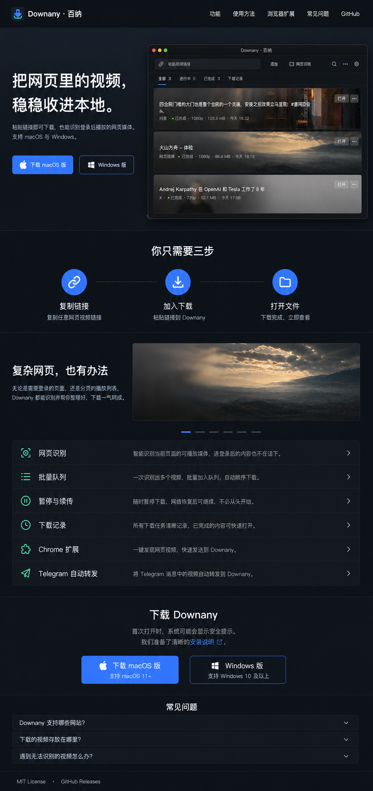
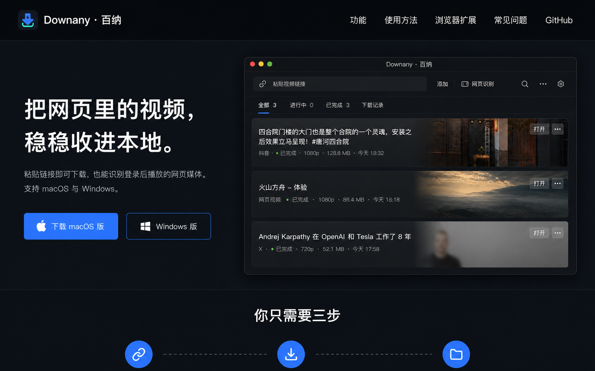
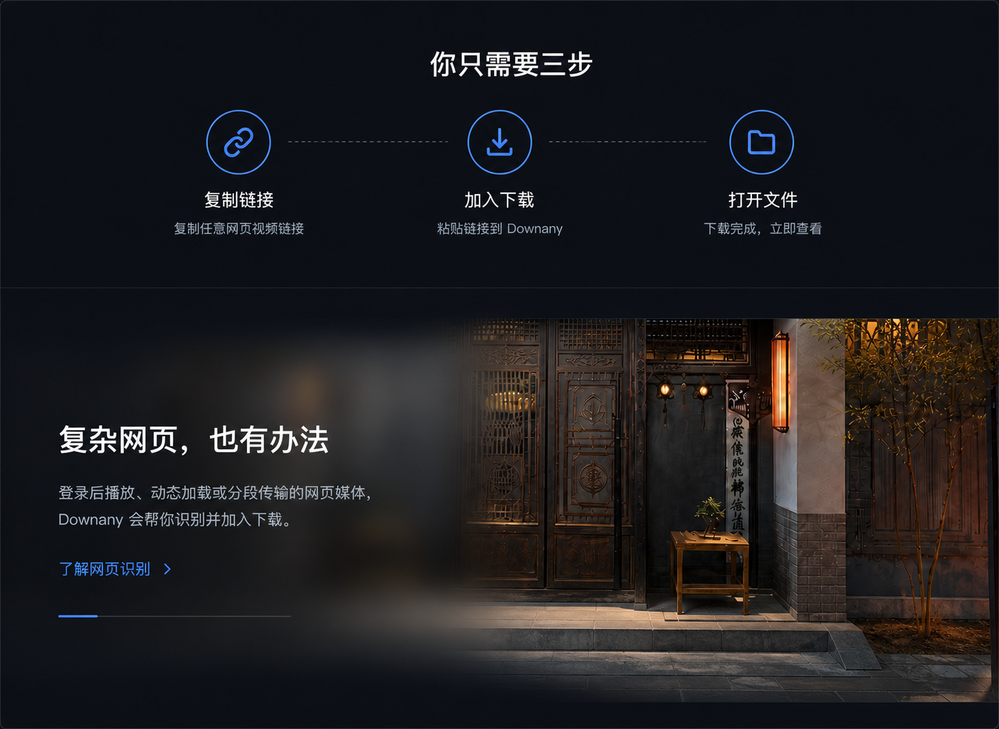
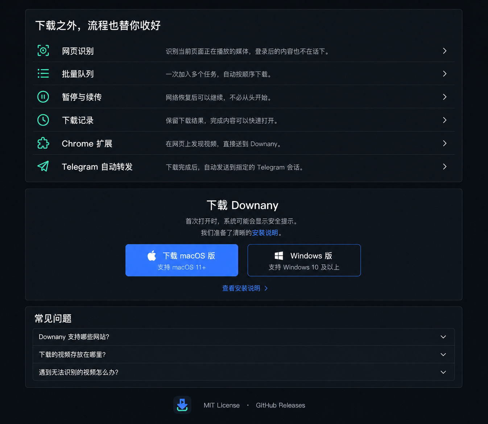
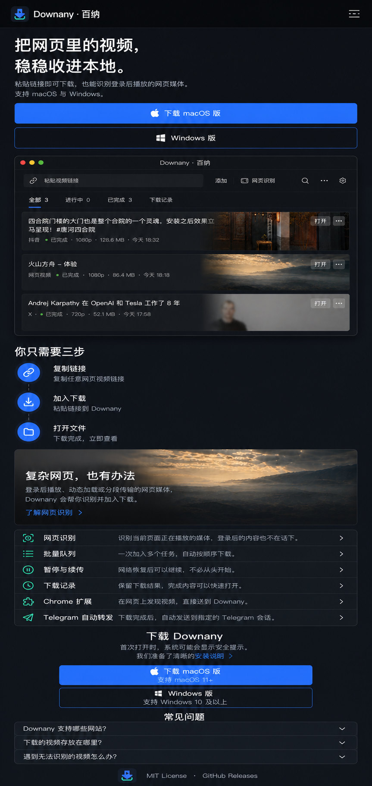

# Downany · 百纳官网设计

- 日期：2026-08-17
- 状态：方案 1 已确认，进入实施
- 产品范围：Downany 官网单页，桌面端与移动端
- 实现位置：`website/`
- 视觉方向：深色媒体舞台

## 1. 目标

官网只解决三个问题：

1. 让访客在首屏看懂 Downany 能把网页视频保存到本地。
2. 展示可信的产品界面和网页识别能力。
3. 把访客送到当前真实可用的 macOS、Windows 或 Chrome 扩展发布物。

官网不承担账号、支付、在线解析、远程下载、用户内容托管或发布后台。当前任务只建设本地可运行的网站，不部署、不绑定域名，也不改变桌面端业务。

## 2. 事实边界

- 产品名称使用 `Downany · 百纳`。
- 功能事实以当前仓库 `README.md`、`docs/TELEGRAM.md` 和可验证源码为依据，不写“支持所有网站”“永久免费”“零失败”等无法证明的承诺。
- 发布物以 GitHub Releases API 的公开结果为准。2026-08-17 核验到最新公开版本为 `v0.1.0`，含 macOS DMG 和 Chrome 扩展 zip，未含 Windows 安装包。
- Windows 下载按钮不得伪装成已有安装包。最新 Release 没有匹配资产时，按钮显示 `Windows 版准备中`，并可前往 Releases 页面查看进展；出现匹配资产后自动恢复为 `下载 Windows 版`。
- `Telegram 自动转发` 已存在于当前源码，但最新公开 `v0.1.0` 未证明包含该能力。网站保持标题不变，将说明降级为 `随下一版本提供。`；只有公开安装包确认包含该能力后，才改为完整能力说明。
- 当前选定的桌面图是已确认视觉基准，不是已完成工程截图。官网本地版可通过非可见替代文本将其标记为“界面预览”；发布前必须替换为经过验收的真实应用截图，且不得含个人文件、Cookie、Token、聊天信息或本地路径。

## 3. 视觉依据

### 3.1 全页方向



### 3.2 分段实施参考









这些图片固定布局、层级、材质和节奏。图片中的网站文字、按钮、列表和 FAQ 必须由 HTML/React 渲染；不得把整张概念图当作网页背景。产品窗口、媒体缩略图和品牌图形使用独立资源。

## 4. 设计原则

1. **媒体是主角**：首屏最大的视觉对象是产品窗口，不使用抽象渐变球、人物图库或装饰插画。
2. **玻璃只出现一次**：全页仅“复杂网页，也有办法”使用主要 `Reading Glass`。普通功能、下载和 FAQ 使用实色表面。
3. **一个区域一个强调**：蓝色只用于当前主操作、焦点和进度；薄荷青只用于品牌与成功语义。
4. **操作层安静**：导航、双平台下载和功能列表不能同时争夺注意力。
5. **结果可验证**：下载链接、平台可用性和功能发布状态来自真实 Release，不写死不存在的安装包。

## 5. 页面结构

页面只有一个路由，顺序固定：

1. `SiteHeader`
2. `Hero`
3. `Workflow`
4. `RecognitionSpotlight`
5. `CapabilityList`
6. `DownloadPanel`
7. `Faq`
8. `SiteFooter`

桌面最大内容宽度为 `1180px`，左右最小边距 `24px`。首屏在 `1440 × 900` 视口中露出下一段标题。页面不增加价格、口碑、下载量、合作品牌、新闻或博客区。

## 6. 文案

### 6.1 首屏允许文案

首屏不得增加 eyebrow、badge、pill、统计或解释性小标题。允许出现的文字只有：

- `Downany · 百纳`
- `功能`
- `使用方法`
- `浏览器扩展`
- `常见问题`
- `GitHub`
- `把网页里的视频，稳稳收进本地。`
- `粘贴链接即可下载，也能识别登录后播放的网页媒体。支持 macOS 与 Windows。`
- `下载 macOS 版`
- `Windows 版` 或事实降级文案 `Windows 版准备中`

### 6.2 使用方法

- 标题：`你只需要三步`
- `复制链接`：`复制任意网页视频链接`
- `加入下载`：`粘贴链接到 Downany`
- `打开文件`：`下载完成，立即查看`

### 6.3 网页识别

- 标题：`复杂网页，也有办法`
- 正文：`登录后播放、动态加载或分段传输的网页媒体，Downany 会帮你识别并加入下载。`
- 动作：`了解网页识别`

### 6.4 能力列表

- 标题：`下载之外，流程也替你收好`
- `网页识别`：`识别当前页面正在播放的媒体，登录后的内容也不在话下。`
- `批量队列`：`一次加入多个任务，自动按顺序下载。`
- `暂停与续传`：`网络恢复后可以继续，不必从头开始。`
- `下载记录`：`保留下载结果，完成内容可以快速打开。`
- `Chrome 扩展`：`在网页上发现视频，直接送到 Downany。`
- `Telegram 自动转发`：公开安装包确认支持后使用 `下载完成后，自动发送到指定的 Telegram 会话。`；此前使用 `随下一版本提供。`

Telegram 行必须同时遵守第 2 节的发布事实边界。

### 6.5 下载与安装

- 标题：`下载 Downany`
- 说明：`首次打开时，系统可能会显示安全提示。我们准备了清晰的安装说明。`
- macOS：`下载 macOS 版`
- Windows 有资产：`下载 Windows 版`
- Windows 无资产：`Windows 版准备中`
- 安装帮助：`查看安装说明`

不显示未经构建配置或发布说明证明的最低系统版本。

### 6.6 常见问题

1. `Downany 支持哪些网站？`
   - `支持 YouTube、Bilibili、抖音、TikTok、Twitter、Instagram 等常见平台。部分页面需要有效登录状态。`
2. `下载的视频存放在哪里？`
   - `默认保存在系统下载目录，也可以在设置中修改。下载完成后可从任务直接打开。`
3. `遇到无法识别的视频怎么办？`
   - `先播放目标视频，再使用网页识别。部分站点需要导入浏览器登录状态后重试。`

## 7. 视觉系统

### 7.1 颜色

官网深色方案锁定以下语义色：

```css
--color-surface-window: #0b0d10;
--color-surface-chrome: #101318;
--color-surface-raised: #15191f;
--color-surface-control: rgba(255, 255, 255, 0.035);
--color-text-primary: rgba(255, 255, 255, 0.92);
--color-text-secondary: rgba(255, 255, 255, 0.64);
--color-text-tertiary: rgba(255, 255, 255, 0.42);
--color-stroke-subtle: rgba(255, 255, 255, 0.08);
--color-stroke-strong: rgba(255, 255, 255, 0.14);
--color-accent: #397bff;
--color-accent-soft: rgba(57, 123, 255, 0.16);
--color-success: #42e6c6;
--color-focus-ring: rgba(91, 124, 250, 0.46);
```

背景是冷调近黑实色，不使用大面积渐变、霓虹光晕或彩色叠层。实现时建立 `website/src/styles/tokens.css`，与 `docs/DESIGN-SYSTEM.md` 对齐；不抢先修改尚未落地的桌面端 Canonical Token 计划。

### 7.2 排版

字体栈：

```css
-apple-system, BlinkMacSystemFont, "SF Pro Text", "PingFang SC",
"Hiragino Sans GB", "Segoe UI", "Microsoft YaHei UI", "Noto Sans SC",
sans-serif
```

| 角色 | 桌面 | 移动 | 字重 |
|---|---:|---:|---:|
| 首屏标题 | `40/52px` | `32/39px` | `600` |
| 分区标题 | `32/42px` | `24/32px` | `600` |
| 列表标题 | `18/26px` | `16/24px` | `500–600` |
| 正文 | `16/26px` | `15/24px` | `400` |
| 控件 | `15/20px` | `15/20px` | `500` |
| 辅助说明 | `13/20px` | `13/20px` | `400` |

只使用 `400 / 500 / 600`，不使用 `700`。中文不增加字间距。

### 7.3 间距、圆角与表面

- 间距只使用 `4 / 8 / 12 / 16 / 20 / 24 / 32 / 40 / 64 / 80 / 96px`。
- 按钮圆角 `8px`，媒体 `10px`，Popover/FAQ 外框 `12–14px`。
- 普通表面不使用投影，只使用细描边和色阶。
- 只有首屏产品窗口允许轻微抬升阴影。
- 能力区是一组列表，不拆成六张卡片。

### 7.4 Reading Glass

- 仅 `RecognitionSpotlight` 使用。
- 桌面覆盖媒体左侧 `58%`，模糊 `36px`，饱和度 `120%`，右缘羽化约 `96px`。
- 移动端采用“媒体在上、文字玻璃轻叠媒体下缘”的结构。
- 不动画模糊强度；减少透明或不支持 `backdrop-filter` 时退化为 `rgba(15, 17, 20, 0.92)` 实色。

## 8. 图像与图标

### 8.1 图像

- 品牌标志直接使用 `assets/brand/logo-mark.svg` 或 `logo-lockup.svg`，不重新生成。
- 首屏产品预览使用独立截图资源；图片保持原比例，不透视、不拉伸、不套彩色滤镜。
- 网页识别媒体图使用仓库内已确认的同一媒体视觉，不从总览概念图裁切。
- 所有图片声明 `width`、`height`，非首屏图片懒加载。

### 8.2 图标

实现使用 Phosphor Icons 的 `regular` 线性风格，视觉尺寸 `16–24px`；不默认使用 Lucide，不使用 Emoji、字体符号或手写 SVG。

图标语义：

- 流程：`LinkSimple`、`DownloadSimple`、`FolderOpen`
- 能力：`Scan`、`ListBullets`、`PauseCircle`、`ClockCounterClockwise`、`PuzzlePiece`、`TelegramLogo`
- 导航与状态：`List`、`CaretRight`、`CaretDown`、`ArrowSquareOut`
- 平台：`AppleLogo`、`WindowsLogo`

正式品牌标志继续使用仓库 SVG，不由图标库替代。

## 9. 响应式

### 9.1 桌面，`>= 1024px`

- 首屏为 `36% / 64%` 双栏。
- 产品窗口完整显示，H1 固定为两行。
- 三步流程水平排列。
- 能力行采用“图标 + 标题 + 描述 + 箭头”四列。

### 9.2 平板，`768–1023px`

- 首屏改为上下结构，文字宽度不超过 `640px`。
- 产品窗口占满内容宽度。
- 三步仍可横排；空间不足时改为三列无连接线。
- 能力行描述列缩短，不隐藏标题和状态。

### 9.3 移动，`< 768px`

- 左右边距 `16px`，导航折叠为 `44px` 菜单按钮。
- 首屏 CTA 垂直堆叠，产品预览位于按钮下方。
- 三步流程改为纵向时间线。
- 媒体图在上，Reading Glass 文字层只轻叠下缘。
- 能力列表保持单组，不变成卡片墙。
- 下载按钮和 FAQ 占满可用宽度。
- 页面不得出现横向滚动。

## 10. 交互与数据流

### 10.1 导航

- `功能` → `#features`
- `使用方法` → `#how-it-works`
- `浏览器扩展` → Chrome 扩展能力行
- `常见问题` → `#faq`
- `GitHub` → 仓库主页，新标签打开并带可访问提示
- 移动菜单支持打开、关闭、Escape、点击链接后关闭和焦点返回。

### 10.2 下载解析

网站启动后请求：

```text
GET https://api.github.com/repos/JackEngineer/downany/releases/latest
```

按资产文件名匹配：

- macOS：`Downany-*-mac.dmg`
- Windows：`Downany-*-win-x64.exe`
- Chrome 扩展：`Downany-chrome-extension-*.zip`

状态：

1. `loading`：按钮文案和尺寸保持不变，链接暂时指向 Releases 页面，避免首屏抖动或出现未批准的加载文案。
2. `ready`：链接到对应 `browser_download_url`。
3. `missing`：不伪造链接；Windows 显示准备中，其他资产回退到 Releases 页面。
4. `error`：显示 `前往 GitHub Releases`，保留人工下载路径。

根据 `navigator.userAgentData` 或 `navigator.userAgent` 只调整主次顺序，不隐藏另一平台。macOS 视觉验收保持方案 1 中 macOS 主按钮在前。

### 10.3 安装说明与 FAQ

- `查看安装说明` 打开仓库中的 `docs/RELEASE.md`，不创建新路由。
- FAQ 使用原生按钮控制 `aria-expanded` 和关联面板。
- 一次只展开一项；再次点击可关闭。

### 10.4 能力行

- `网页识别` 回到 `RecognitionSpotlight`。
- `Chrome 扩展` 打开仓库中的扩展说明。
- `Telegram 自动转发` 打开 `docs/TELEGRAM.md`。
- 其余行打开 README 对应功能说明；不能点击的行不显示箭头，也不伪装成按钮。

## 11. 工程结构

使用 React 18、TypeScript、Vite 和 Vitest，建立独立 `website/` 包：

```text
website/
  index.html
  package.json
  tsconfig.json
  vite.config.ts
  src/
    main.tsx
    App.tsx
    components/
      SiteHeader.tsx
      Hero.tsx
      ProductPreview.tsx
      Workflow.tsx
      RecognitionSpotlight.tsx
      CapabilityList.tsx
      DownloadPanel.tsx
      Faq.tsx
      SiteFooter.tsx
    content/siteContent.ts
    hooks/useLatestRelease.ts
    lib/releases.ts
    styles/
      tokens.css
      foundations.css
      site.css
    test/
      setup.ts
```

- `App` 只组合分区，不承载 Release 解析和大段内容常量。
- `siteContent.ts` 是可见文案事实源。
- `releases.ts` 是纯函数，负责匹配资产和平台降级。
- `useLatestRelease.ts` 只负责请求状态和取消。
- CSS 使用语义 Token，不散落十六进制颜色。
- 不接入后端、分析 SDK、Cookie、账户系统或持久化。

## 12. 可访问性、性能与 SEO

- 正文达到 WCAG AA `4.5:1`；控件和焦点至少 `3:1`。
- 所有交互目标最小 `44 × 44px`；键盘焦点统一 `2px`。
- 支持 `prefers-reduced-motion` 和 `prefers-reduced-transparency`；不支持后者的浏览器可通过站内静态降级类验证。
- 页面只有一个 H1，分区标题按 H2 排列。
- `title`、description、Open Graph、favicon 使用真实品牌与稳定文案。
- 首屏产品图预加载；其余图懒加载；避免布局位移。
- 目标为生产构建首屏资源不含概念总览图，概念图只保留在文档。

## 13. 测试与验收

### 13.1 自动化

- Release 资产匹配：macOS、Windows、扩展、缺失资产、API 失败。
- 平台排序：macOS、Windows、其他平台。
- 下载按钮状态：loading、ready、missing、error。
- FAQ：点击、键盘、`aria-expanded`、单项展开。
- 移动菜单：打开、Escape、点击导航后关闭、焦点返回。
- 可见文案合同：首屏不出现未允许的 eyebrow、badge 或虚假统计。

### 13.2 构建

```bash
cd website
npm test
npm run build
```

### 13.3 浏览器

- 使用 Codex 内置浏览器验证，不默认改用外部 Chrome。
- 桌面视口：`1440 × 900`。
- 移动视口：`390 × 844`。
- 检查导航、CTA、Release 降级、FAQ、移动菜单、控制台和横向溢出。
- 使用相同视口截图与本规格中的视觉参考逐段对照。
- `design-qa.md` 必须记录至少五项视觉比较，并达到 `final result: passed`。

## 14. 不做的内容

- 不部署、不绑定域名、不创建线上环境。
- 不修改桌面端、Sidecar、扩展或 Telegram 行为。
- 不承诺 Windows 安装包已经公开。
- 不加入统计、埋点、表单、邮件订阅、评论、定价、博客或多语言。
- 不把生成概念图直接当生产页面。

## 15. 完成定义

- 视觉忠实复现方案 1，并通过桌面与移动端 Design QA。
- 页面所有关键控件可交互，下载链接来自真实 Release。
- 缺失 Windows 资产时不误导用户。
- 品牌、颜色、Reading Glass 数量、列表结构和首屏文案满足本规格。
- 测试与构建通过；本地预览可打开且控制台无错误。
- 代码与设计资产形成独立 Git 提交，不推送远端。
